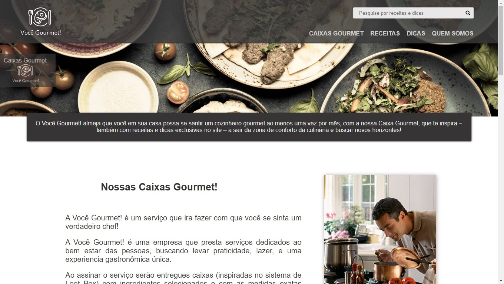
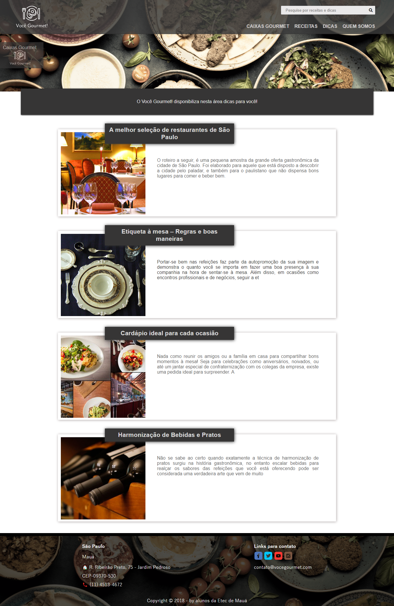
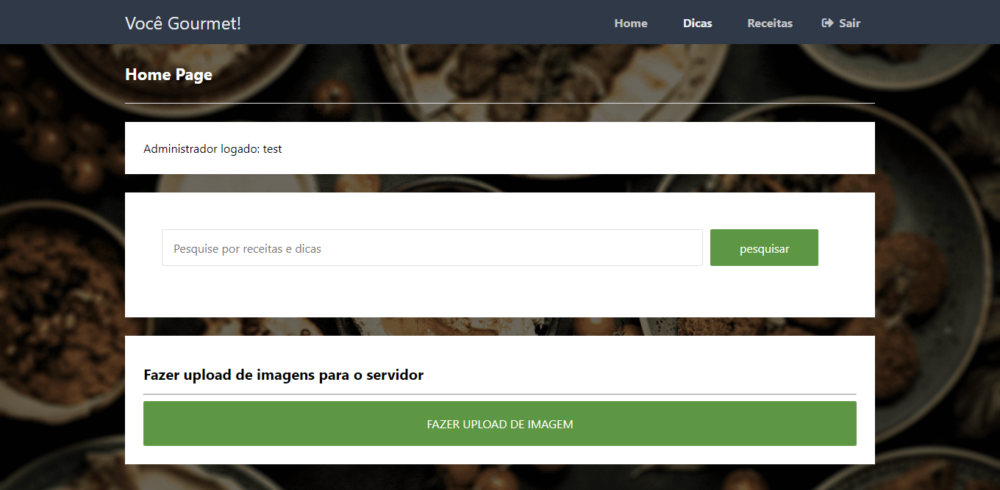
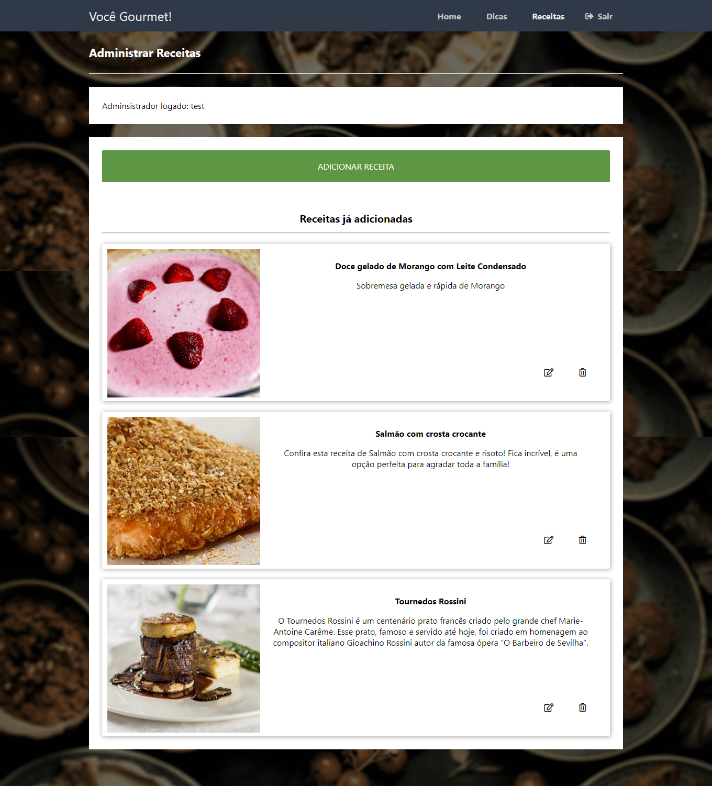

<h2 align="center">
  
  
</h2>

<h1 align="center">
  
</h1>

## 🔎 Sobre o projeto
<p>A Você Gourmet! que é uma empresa que presta serviços de assinatura em que são entregues caixas (inspiradas no sistema de Loot Box) com ingredientes selecionados e com as medidas exatas para a realização de uma receita. </p>

<p>Além do serviço de assinatura a Você Gourmet! é um site de culinária completo, com seleções de receitas e dicas.</p>

**Esse projeto foi desenvolvido como TCC da Etec de Mauá da turma de Análise e Desenvolvimento de Sistemas de 2018**

### Features

- [x] Pagina de administração
- [x] Sistema de autenticação e encriptação de senhas
- [x] Retrição de áreas reservadas à administradores
- [x] Página de cdastro de receitas e dicas por administradores
- [x] Listagem de receitas e dicas
- [x] Sistema de busca de receitas e dicas
- [x] Página de apresentação das caixas gourmet

<p>&nbsp;</p>

O layout completo do projeto pode ser visto na ferramenta de design de interface **Figma**
- [Layout web](https://www.figma.com/file/Y7sHzKwqD7JUpYjhyS8lDm/Happy-Web-2.0)
- [Layout mobile](https://www.figma.com/file/vXzfEAGZIYKUeeeVW8uGQe/Happy-Mobile)

<p>&nbsp;</p>

## 🛠 Tecnologias e sua aplicação no projeto
- [PHP](https://www.php.net/manual/pt_BR/intro-whatis.php)
- HTML
- CSS
- [JavaScript](https://www.javascript.com/)
- [MySql](https://www.mysql.com/)
  
<p>&nbsp;</p>

## 🚀 Demonstração

<p align="center"><b>Home</b></p>
<p align="center">
  
</p>

<p>&nbsp;</p>

<p align="center"><b>Listagem de Dicas</b></p>
<p align="center">
  
</p>

<p>&nbsp;</p>

<p align="center"><b>Pagina de administração</b></p>
<p align="center">
  
</p>

<p>&nbsp;</p>

<p align="center"><b>Pagina de administração de receitas</b></p>
<p align="center">
  
</p>

<p>&nbsp;</p>
<p>&nbsp;</p>

## Instalação e start
Esse é uma aplicação de **arquitetura monolítica**, ou seja, ambas a interface de usuário e códigos de acesso a dados estão nessa mesma peça de software. Essa escolha arquitetural faz com que a clonagem desse repositório seja a única de que precisa fazer para poder dar start a aplicação. 

### Pré-requisitos
A maneira mais simples de rodar esse projeto é com softwares que auxiliam no setup de desenvolvimento de aplicações escritas em PHP, tais como [XAMPP](https://www.apachefriends.org/pt_br/index.html) ou [WampServer](https://www.wampserver.com/en/). Ambos instalam uma distribuição Apache, contendo MySQL e PHP.

### Clonando o repositório
Para rodar a aplicação com XAMPP a clonagem do repositório deve ser feita em `... \xampp\htdocs`.
Para rodar a aplicação com WampServer a clonagem do repositório deve ser feita `... \wamp64\www`.

```bash
> git clone https://github.com/Vavarine/happy
```

### Setup do banco de dados
Com o servidor MySql rodando é necessário rodar o script do banco de dados da apicação. 
Pelo phpMyAdmin basta a clicar na opção de importação de script e importar o arquivo `banco/script.sql`.
Se feito por **MySQL Console**:

```bash
mysql> source ... /banco/script.sql
```

Pode ser que seja necessária extra configuração em relação a authenticação no banco de dados. Para mudanças na conexão da aplicação com o banco modifique o valor das variáveis em `conexao.php`

### Rodando a aplicação
Depois da inicialização dos servidores Apache e MySQL:

O aplicação estara rodando na porta:8080 - acesse <http://localhost:8080/vocegourmet> 

<p>&nbsp;</p>

---

## Sobre mim

Feito com ❤️ por Evailson Barbosa 👋🏽 Entre em contato!

[](https://www.linkedin.com/in/evailson-barbosa/) 
[](mailto:evailson.m.barbosa@gmail.com)
